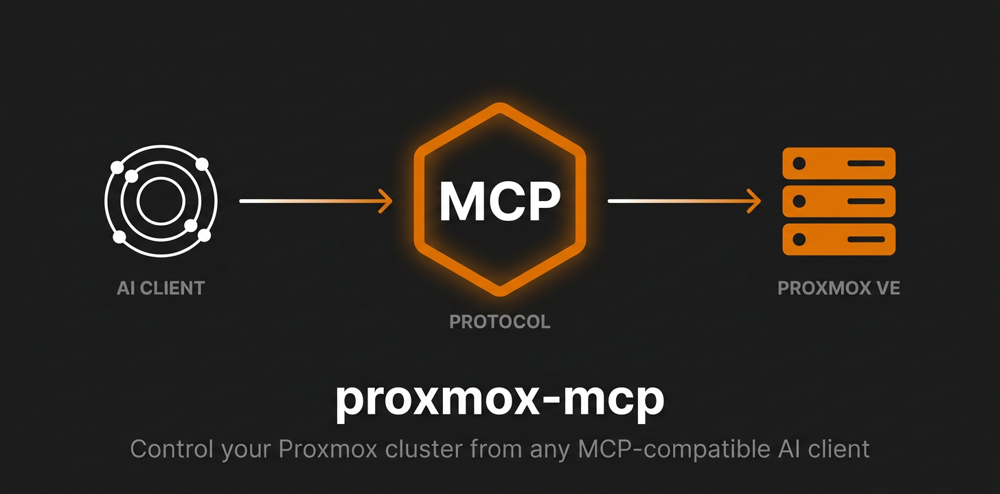

<!-- mcp-name: io.github.akmalovaa/proxmox-mcp -->

# Proxmox MCP server

<p align="center">
  
</p>

[](https://github.com/akmalovaa/proxmox-mcp/actions/workflows/ci.yml)
[](https://github.com/akmalovaa/proxmox-mcp/releases)
[](LICENSE)
[](https://www.python.org/)
[](https://github.com/akmalovaa/proxmox-mcp/pkgs/container/proxmox-mcp)
[](https://modelcontextprotocol.io)

## Simple Proxmox MCP

<p align="center">
  
</p>

MCP server for managing Proxmox VE

**38 tools** — nodes, QEMU VMs, LXC containers, storage, cluster, snapshots.

### Why this one?

- **One image**, multi-arch — `docker run ghcr.io/akmalovaa/proxmox-mcp:latest` and you're done
- **Just env vars** — no config files, no database, no state
- **Read-only by default** — destructive ops are gated behind an explicit `PROXMOX_RISK_LEVEL`
- **Tiny codebase** — pure stdio MCP over Proxmoxer, no HTTP server, no auth layer, no extras
- **Raw JSON out** — no formatting, no emoji; LLM gets clean data

[](https://glama.ai/mcp/servers/akmalovaa/proxmox-mcp)


## Quick start

**Image:** `ghcr.io/akmalovaa/proxmox-mcp:latest` (multi-arch: `amd64` + `arm64`).

**1. Export credentials in your shell profile** (`~/.zprofile`, `~/.zshrc` or `~/.bashrc`):

```bash
# base environment:
export PROXMOX_HOST=192.168.1.100
export PROXMOX_USER=root@pam
export PROXMOX_PASSWORD=your-password

# or use token auth (recommended):
export PROXMOX_TOKEN_NAME=mcp
export PROXMOX_TOKEN_VALUE=xxxxxxxx-xxxx-xxxx-xxxx-xxxxxxxxxxxx

# optional:
export PROXMOX_RISK_LEVEL=read
```

Reload: `source ~/.zprofile` (or restart the shell).

**2. Add to `~/.claude/settings.json` (Claude Code) or `claude_desktop_config.json` (Claude Desktop)**:

```json
{
  "mcpServers": {
    "proxmox": {
      "command": "docker",
      "args": ["run", "-i", "--rm",
        "-e", "PROXMOX_HOST",
        "-e", "PROXMOX_USER",
        "-e", "PROXMOX_PASSWORD",
        "ghcr.io/akmalovaa/proxmox-mcp:latest"]
    }
  }
}
```

or token auth:

```json
{
  "mcpServers": {
    "proxmox": {
      "command": "docker",
      "args": ["run", "-i", "--rm",
        "-e", "PROXMOX_HOST",
        "-e", "PROXMOX_USER",
        "-e", "PROXMOX_TOKEN_NAME",
        "-e", "PROXMOX_TOKEN_VALUE",
        "ghcr.io/akmalovaa/proxmox-mcp:latest"]
    }
  }
}
```

`docker run -e VAR` without a value passes the host variable through — no secrets in the config file. Restart the client — 38 Proxmox tools become available.

For password auth, swap the token vars for `PROXMOX_PASSWORD`.

> **Note:** Claude Desktop on macOS is launched via launchd and does **not** inherit `~/.zprofile`/`~/.zshrc`. Either put the exports in `~/.zshenv`, or fall back to an inline `"env": { ... }` block in the config.

## Configuration

All settings are environment variables — set them in your shell profile, pass them inline to `docker run -e`, or declare them in your MCP client's `env` block.

| Variable | Default | Description |
|----------|---------|-------------|
| `PROXMOX_HOST` | — | Proxmox host (IP or hostname) |
| `PROXMOX_USER` | `root@pam` | API user |
| **Auth** | — | **token *or* password — see below** |
| `PROXMOX_PORT` | `8006` | API port |
| `PROXMOX_VERIFY_SSL` | `false` | Verify TLS certificate |
| `PROXMOX_RISK_LEVEL` | `read` | `read` / `lifecycle` / `all` |

### Authentication: token *or* password

Pick **one**. If both are set, the token wins.

**Token (recommended)** — create in Proxmox UI: *Datacenter → Permissions → API Tokens → Add* (uncheck *Privilege Separation*). Then:

```bash
export PROXMOX_TOKEN_NAME=mcp
export PROXMOX_TOKEN_VALUE=xxxxxxxx-xxxx-xxxx-xxxx-xxxxxxxxxxxx
```

**Password (fallback)**:

```bash
export PROXMOX_PASSWORD=your-password
```

### Risk levels

`PROXMOX_RISK_LEVEL` gates destructive operations:

| Level | Adds |
|-------|------|
| `read` *(default)* | read-only tools |
| `lifecycle` | + start / stop / reboot / suspend / clone / create-snapshot |
| `all` | + delete-snapshot / rollback-snapshot |

Every elevated call is logged to stderr (`ALLOW` / `DENY` + tool + tier).

## Tools

### Nodes (7)

| Tool | Description |
|------|-------------|
| `list_nodes` | List all cluster nodes with status, CPU, memory, uptime |
| `get_node_status` | Detailed node metrics (CPU, memory, disk, load, kernel) |
| `get_node_networks` | Network interfaces on a node |
| `get_node_disks` | Physical disks on a node |
| `get_node_tasks` | Recent tasks on a node |
| `get_task_status` | Status of a specific task by UPID |
| `get_task_log` | Log output from a task |

### QEMU VMs (14)

| Tool | Tier | Description |
|------|------|-------------|
| `list_vms` | read | List all VMs, optionally filter by node |
| `get_vm_status` | read | Current VM status (running/stopped, CPU, memory) |
| `get_vm_config` | read | VM configuration (hardware, disks, network) |
| `list_vm_snapshots` | read | List all snapshots of a VM |
| `start_vm` | lifecycle | Start a VM |
| `stop_vm` | lifecycle | Force-stop a VM |
| `shutdown_vm` | lifecycle | Graceful ACPI shutdown with timeout |
| `reboot_vm` | lifecycle | Reboot via ACPI |
| `suspend_vm` | lifecycle | Suspend a VM |
| `resume_vm` | lifecycle | Resume a suspended VM |
| `clone_vm` | lifecycle | Full or linked clone |
| `create_vm_snapshot` | lifecycle | Create a snapshot |
| `delete_vm_snapshot` | all | Delete a snapshot |
| `rollback_vm_snapshot` | all | Rollback to a snapshot |

### LXC Containers (11)

| Tool | Tier | Description |
|------|------|-------------|
| `list_containers` | read | List all LXC containers, optionally filter by node |
| `get_container_status` | read | Current container status |
| `get_container_config` | read | Container configuration |
| `list_container_snapshots` | read | List all snapshots |
| `start_container` | lifecycle | Start a container |
| `stop_container` | lifecycle | Force-stop a container |
| `shutdown_container` | lifecycle | Graceful shutdown with timeout |
| `reboot_container` | lifecycle | Reboot a container |
| `create_container_snapshot` | lifecycle | Create a snapshot |
| `delete_container_snapshot` | all | Delete a snapshot |
| `rollback_container_snapshot` | all | Rollback to a snapshot |

### Storage (2)

| Tool | Description |
|------|-------------|
| `list_storage` | Storage pools with usage, optionally filter by node |
| `get_storage_content` | Contents of a storage pool (ISOs, backups, images, templates) |

### Cluster (4)

| Tool | Description |
|------|-------------|
| `get_cluster_status` | Cluster health, quorum, node membership |
| `get_cluster_resources` | All resources (VMs, containers, storage, nodes) |
| `get_cluster_backups` | Configured backup jobs |
| `get_next_vmid` | Next available VM/container ID |

## Architecture

```
src/proxmox_mcp/
├── server.py    # FastMCP instance + entry point
├── config.py    # Pydantic Settings (PROXMOX_ prefix)
├── client.py    # Proxmoxer connection via lifespan
└── tools/       # nodes, vms, containers, storage, cluster
```

- **Read-only by default** — elevated tools gated by `PROXMOX_RISK_LEVEL`
- **Single connection** — Proxmoxer client created once at startup, shared via lifespan
- **Raw JSON output** — no formatting; LLM consumes data directly

## Development

### Run standalone (testing)

```bash
export PROXMOX_HOST=192.168.1.100
export PROXMOX_USER=root@pam
export PROXMOX_TOKEN_NAME=mcp
export PROXMOX_TOKEN_VALUE=xxxxxxxx-xxxx-xxxx-xxxx-xxxxxxxxxxxx

docker run -i --rm \
  -e PROXMOX_HOST -e PROXMOX_USER \
  -e PROXMOX_TOKEN_NAME -e PROXMOX_TOKEN_VALUE \
  ghcr.io/akmalovaa/proxmox-mcp:latest
```

### Without Docker (UV)

```bash
git clone https://github.com/akmalovaa/proxmox-mcp.git && cd proxmox-mcp && uv sync
```

MCP client config:

```json
{
  "mcpServers": {
    "proxmox": {
      "command": "uv",
      "args": ["run", "--directory", "/path/to/proxmox-mcp", "python", "-m", "proxmox_mcp"],
      "env": {
        "PROXMOX_HOST": "192.168.1.100",
        "PROXMOX_TOKEN_NAME": "mcp",
        "PROXMOX_TOKEN_VALUE": "xxxxxxxx-xxxx-xxxx-xxxx-xxxxxxxxxxxx"
      }
    }
  }
}
```

### Build from source

```bash
git clone https://github.com/akmalovaa/proxmox-mcp.git
cd proxmox-mcp
docker build -t proxmox-mcp .
```

## License

MIT
