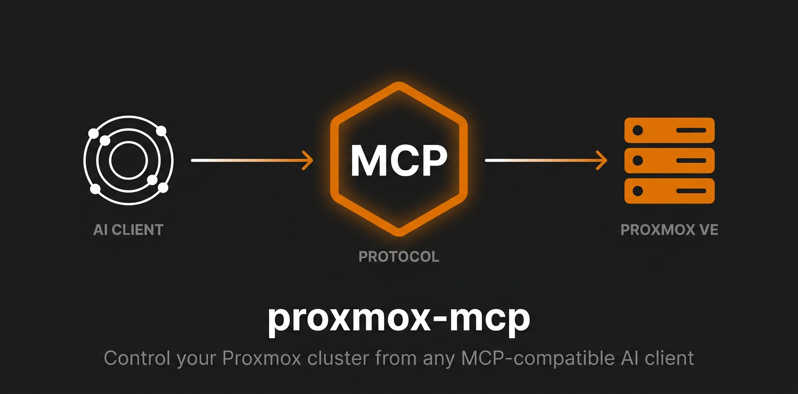

<!-- mcp-name: io.github.akmalovaa/proxmox-mcp -->

# Proxmox MCP server

<p align="center">
  
</p>

[](https://github.com/akmalovaa/proxmox-mcp/actions/workflows/ci.yml)
[](https://github.com/akmalovaa/proxmox-mcp/releases)
[](LICENSE)
[](https://www.python.org/)
[](https://github.com/akmalovaa/proxmox-mcp/pkgs/container/proxmox-mcp)
[](https://modelcontextprotocol.io)

## Simple Proxmox MCP

<p align="center">
  
</p>

MCP server for managing Proxmox VE

**50 tools** — nodes, QEMU VMs, LXC containers, storage, cluster, snapshots.

### Why this one?

- **One image**, multi-arch — `docker run ghcr.io/akmalovaa/proxmox-mcp:latest` and you're done
- **Just env vars** — no config files, no database, no state
- **Read-only by default** — destructive ops are gated behind an explicit `PROXMOX_RISK_LEVEL`
- **stdio or Streamable HTTP** — one env var apart; stdio by default, HTTP binds loopback
- **Tiny codebase** — a thin layer over Proxmoxer, no config files, no database, no state
- **Raw JSON out** — no formatting, no emoji; LLM gets clean data
- **Readable failures** — a 403, a dead host or a blocked tier come back as a sentence, not a stack trace

[](https://glama.ai/mcp/servers/akmalovaa/proxmox-mcp)


## Quick start

**Image:** `ghcr.io/akmalovaa/proxmox-mcp:latest` (multi-arch: `amd64` + `arm64`).

**1. Export credentials in your shell profile** (`~/.zprofile`, `~/.zshrc` or `~/.bashrc`):

```bash
# token auth (recommended — see "Least privilege" for the user and role to give it):
export PROXMOX_HOST=192.168.1.100
export PROXMOX_USER=mcp@pve
export PROXMOX_TOKEN_NAME=mcp
export PROXMOX_TOKEN_VALUE=xxxxxxxx-xxxx-xxxx-xxxx-xxxxxxxxxxxx

# or password auth:
# export PROXMOX_USER=root@pam
# export PROXMOX_PASSWORD=your-password

# optional:
export PROXMOX_RISK_LEVEL=read
```

Reload: `source ~/.zprofile` (or restart the shell).

**2. Add to `~/.claude/settings.json` (Claude Code) or `claude_desktop_config.json` (Claude Desktop)**:

```json
{
  "mcpServers": {
    "proxmox": {
      "command": "docker",
      "args": ["run", "-i", "--rm",
        "-e", "PROXMOX_HOST",
        "-e", "PROXMOX_USER",
        "-e", "PROXMOX_PASSWORD",
        "ghcr.io/akmalovaa/proxmox-mcp:latest"]
    }
  }
}
```

or token auth:

```json
{
  "mcpServers": {
    "proxmox": {
      "command": "docker",
      "args": ["run", "-i", "--rm",
        "-e", "PROXMOX_HOST",
        "-e", "PROXMOX_USER",
        "-e", "PROXMOX_TOKEN_NAME",
        "-e", "PROXMOX_TOKEN_VALUE",
        "ghcr.io/akmalovaa/proxmox-mcp:latest"]
    }
  }
}
```

`docker run -e VAR` without a value passes the host variable through — no secrets in the config file. Restart the client — 32 read-only Proxmox tools become available (more if you raise `PROXMOX_RISK_LEVEL`).

For password auth, swap the token vars for `PROXMOX_PASSWORD`.

> **Note:** Claude Desktop on macOS is launched via launchd and does **not** inherit `~/.zprofile`/`~/.zshrc`. Either put the exports in `~/.zshenv`, or fall back to an inline `"env": { ... }` block in the config.

## Configuration

All settings are environment variables — set them in your shell profile, pass them inline to `docker run -e`, or declare them in your MCP client's `env` block.

| Variable | Default | Description |
|----------|---------|-------------|
| `PROXMOX_HOST` | — | Proxmox host (IP or hostname) |
| `PROXMOX_USER` | `root@pam` | API user |
| **Auth** | — | **token *or* password — see below** |
| `PROXMOX_PORT` | `8006` | API port |
| `PROXMOX_VERIFY_SSL` | `false` | Verify TLS certificate |
| `PROXMOX_TIMEOUT` | `15` | Seconds to wait for each API request |
| `PROXMOX_RISK_LEVEL` | `read` | `read` / `lifecycle` / `all` — see [Risk levels](#risk-levels) |
| `PROXMOX_TOOLS_ALLOW` | — | Comma-separated tool names to register, on top of the risk level |
| `PROXMOX_REDACT_SECRETS` | `true` | Mask `cipassword` / `sshkeys` in responses |

Transport settings live under a `PROXMOX_MCP_` prefix — see [Streamable HTTP](#streamable-http).

### Authentication: token *or* password

Pick **one**. If both are set, the token wins.

**Token (recommended)**:

```bash
export PROXMOX_USER=mcp@pve
export PROXMOX_TOKEN_NAME=mcp
export PROXMOX_TOKEN_VALUE=xxxxxxxx-xxxx-xxxx-xxxx-xxxxxxxxxxxx
```

Setting only one half of the pair is a startup error rather than a silent fallback to
the password — a typo in `PROXMOX_TOKEN_NAME` used to mean quietly running as whoever
`PROXMOX_USER` is.

**Password (fallback)**:

```bash
export PROXMOX_PASSWORD=your-password
```

### Least privilege

An MCP server is reachable by a model acting on text it did not write, so give it its
own user and its own token rather than `root@pam`. On the Proxmox host:

```bash
# a user that is not root, with a role that matches the risk level you plan to run
pveum user add mcp@pve
pveum acl modify / --users mcp@pve --roles PVEAuditor          # read
# pveum acl modify / --users mcp@pve --roles PVEVMAdmin        # lifecycle / all

# a token for that user. Privilege Separation ON (the default) means the token starts
# with no rights at all, so grant it the same role explicitly:
pveum user token add mcp@pve mcp --privsep 1
pveum acl modify / --tokens 'mcp@pve!mcp' --roles PVEAuditor
```

Check what the token actually ended up with:

```bash
pveum user permissions mcp@pve --token mcp
```

`PVEAuditor` covers all 32 read tools. `PVEVMAdmin` on `/vms` adds guest lifecycle and
snapshots; `migrate_vm` additionally needs `VM.Migrate` on the target node, and
`clone_vm` needs `Datastore.AllocateSpace` on the target storage. Narrow the ACL path
(`/vms/101`, `/pool/homelab`) if the server should only see part of the cluster.

`root@pam` still works and is the quickest thing for a local look around — it is just
not what should be left running.

### Risk levels

`PROXMOX_RISK_LEVEL` controls which tools exist. Tools above the active level are **not registered**, so they never appear in the MCP client's tool list:

| Level | Tools | Adds |
|-------|-------|------|
| `read` *(default)* | 32 | read-only tools |
| `lifecycle` | 46 | + start / stop / reboot / suspend / clone / migrate / create-snapshot |
| `all` | 50 | + delete-snapshot / rollback-snapshot |

Each elevated call is also re-checked at call time and logged to stderr (`ALLOW` / `DENY` + tool + tier).

The active level is not otherwise observable from the client side — a tool that is
missing looks the same as a tool that was never written — so `get_server_info` reports
it, along with the versions and the tool count.

`PROXMOX_TOOLS_ALLOW` narrows further **within** the tier, for a deployment that serves
one specific agent:

```bash
export PROXMOX_TOOLS_ALLOW=list_nodes,list_containers,get_container_status,get_cluster_resources
```

Names that do not exist are a startup error, so a typo cannot silently amputate the
tool list. Keep `get_server_info` on the list unless you have a reason not to — it is
how a client learns what the rest of the list means.

### Response shape

Inventory listings (`list_nodes`, `list_vms`, `list_containers`, `get_cluster_resources`)
return a compact subset of each row: identity, status, uptime, CPU and memory. What is
dropped is per-second IO counters and PSI pressure gauges — real data, but nothing a
triage decision turns on, and several times the volume of what is kept. Pass
`verbose=true` for the untouched rows.

Write tools answer with the task Proxmox accepted, not with a finished result:

```json
{"state":"accepted","operation":"start_vm","node":"pve","vmid":101,
 "upid":"UPID:pve:...","poll_with":"get_task_status"}
```

`cipassword` and `sshkeys` are replaced with `***redacted***` everywhere, keeping the key
so the model can still tell that cloud-init is configured. Set
`PROXMOX_REDACT_SECRETS=false` to get the raw values.

### Streamable HTTP

stdio stays the default and is what an MCP client on your own machine should use. For a
shared deployment — a container in a cluster, several clients on one URL — set the
transport and nothing else changes:

```bash
docker run --rm -p 8000:8000 \
  -e PROXMOX_HOST -e PROXMOX_TOKEN_NAME -e PROXMOX_TOKEN_VALUE \
  -e PROXMOX_MCP_TRANSPORT=streamable-http \
  -e PROXMOX_MCP_HOST=0.0.0.0 \
  -e PROXMOX_MCP_ALLOWED_HOSTS=proxmox-mcp.example.com \
  ghcr.io/akmalovaa/proxmox-mcp:latest
```

| Variable | Default | Description |
|----------|---------|-------------|
| `PROXMOX_MCP_TRANSPORT` | `stdio` | `stdio` or `streamable-http` |
| `PROXMOX_MCP_HOST` | `127.0.0.1` | Bind address — `0.0.0.0` in a container |
| `PROXMOX_MCP_PORT` | `8000` | Port |
| `PROXMOX_MCP_PATH` | `/mcp` | Endpoint path |
| `PROXMOX_MCP_JSON_RESPONSE` | `true` | JSON responses instead of an SSE stream |
| `PROXMOX_MCP_ALLOWED_HOSTS` | — | `Host` headers to accept; `*` disables the check |
| `PROXMOX_MCP_ALLOWED_ORIGINS` | — | Browser origins allowed; empty = same-origin only |

The prefix is `PROXMOX_MCP_`, not `PROXMOX_`, because Kubernetes injects `<SERVICE>_PORT`
for every linked Service — a Service named `proxmox` would otherwise redefine
`PROXMOX_PORT`.

Sessions are not used (`stateless_http`): they were removed from the protocol in
revision 2026-07-28, and without them several clients can share one URL and a rolling
update does not cut anyone off.

**Host and Origin validation.** Binding anything other than loopback requires
`PROXMOX_MCP_ALLOWED_HOSTS`; the server refuses to start otherwise. A foreign `Origin`
gets 403 and an unexpected `Host` gets 421 — this is what stops a page in a browser on
the same LAN from driving the server through DNS rebinding. A request with no `Origin`
header (curl, MCP clients) always passes. Set `PROXMOX_MCP_ALLOWED_HOSTS=*` only when
something in front already validates it.

**There is no authentication.** Anyone who can reach the endpoint gets whatever
`PROXMOX_RISK_LEVEL` allows. Put it behind a gateway, an authenticating proxy or a
network boundary you trust, and keep `PROXMOX_RISK_LEVEL=read` unless the path to it is
authenticated.

**Health endpoints** are served alongside `/mcp` and need no auth:

| Path | Meaning |
|------|---------|
| `GET /healthz` | The process is up. Never touches Proxmox — a liveness probe that fails when Proxmox is down would restart the server in a loop and fix nothing. |
| `GET /readyz` | Proxmox answered `version.get()`. This is the one that should gate traffic; 503 with a readable reason otherwise. |

```yaml
livenessProbe:
  httpGet: { path: /healthz, port: 8000 }
readinessProbe:
  httpGet: { path: /readyz, port: 8000 }
```

Flags mirror the variables for interactive use: `uvx proxmox-ve-mcp --transport
streamable-http --port 8080`.

### Sentry (optional)

Tool calls and failures can be shipped to [Sentry](https://sentry.io) — every `tools/call`
becomes a span, every failing tool an issue. Nothing is sent, and the SDK is never even
imported, while `SENTRY_DSN` is unset.

The `ghcr.io` image already contains the SDK. From PyPI, install the extra:

```bash
uvx --from 'proxmox-ve-mcp[sentry]' proxmox-ve-mcp
```

| Variable | Default | Description |
|----------|---------|-------------|
| `SENTRY_DSN` | — | Set it to enable reporting |
| `SENTRY_ENVIRONMENT` | `production` | Free-form environment label |
| `SENTRY_TRACES_SAMPLE_RATE` | `1.0` | Share of tool calls traced |
| `SENTRY_SEND_DEFAULT_PII` | `false` | Send tool arguments and results as span data |

Leave `SENTRY_SEND_DEFAULT_PII` off unless you mean it: with it on, tool arguments and
results are attached to spans, and `get_vm_config` returns ssh keys and `cipassword`
hashes. A DSN set without the extra installed logs a warning and the server runs on.

## Tools

### Nodes (10)

| Tool | Description |
|------|-------------|
| `list_nodes` | List all cluster nodes with status, CPU, memory, uptime |
| `get_node_status` | Detailed node metrics (CPU, memory, disk, load, kernel) |
| `get_node_networks` | Network interfaces on a node |
| `get_node_disks` | Physical disks on a node |
| `get_node_services` | Proxmox system services and their state |
| `get_node_updates` | Pending APT package updates |
| `get_node_rrd_data` | Historical CPU/memory/disk/network metrics (RRD) |
| `get_node_tasks` | Recent tasks on a node, optionally errors only |
| `get_task_status` | Status of a specific task by UPID |
| `get_task_log` | Log output from a task |

### QEMU VMs (17)

| Tool | Tier | Description |
|------|------|-------------|
| `list_vms` | read | List all VMs, optionally filter by node |
| `get_vm_status` | read | Current VM status (running/stopped, CPU, memory) |
| `get_vm_config` | read | VM configuration (hardware, disks, network) |
| `get_vm_network_interfaces` | read | **IP addresses** of a running VM (via QEMU guest agent) |
| `get_vm_rrd_data` | read | Historical CPU/memory/disk/network metrics (RRD) |
| `list_vm_snapshots` | read | List all snapshots of a VM |
| `start_vm` | lifecycle | Start a VM |
| `stop_vm` | lifecycle | Force-stop a VM — annotated destructive, unsaved guest state is lost |
| `shutdown_vm` | lifecycle | Graceful ACPI shutdown with timeout |
| `reboot_vm` | lifecycle | Reboot via ACPI |
| `suspend_vm` | lifecycle | Suspend a VM |
| `resume_vm` | lifecycle | Resume a suspended VM |
| `clone_vm` | lifecycle | Full or linked clone |
| `migrate_vm` | lifecycle | Move a VM to another node, online or offline |
| `create_vm_snapshot` | lifecycle | Create a snapshot |
| `delete_vm_snapshot` | all | Delete a snapshot |
| `rollback_vm_snapshot` | all | Rollback to a snapshot |

### LXC Containers (13)

| Tool | Tier | Description |
|------|------|-------------|
| `list_containers` | read | List all LXC containers, optionally filter by node |
| `get_container_status` | read | Current container status |
| `get_container_config` | read | Container configuration |
| `get_container_interfaces` | read | **IP addresses** of a running container |
| `get_container_rrd_data` | read | Historical CPU/memory/disk/network metrics (RRD) |
| `list_container_snapshots` | read | List all snapshots |
| `start_container` | lifecycle | Start a container |
| `stop_container` | lifecycle | Force-stop a container — annotated destructive |
| `shutdown_container` | lifecycle | Graceful shutdown with timeout |
| `reboot_container` | lifecycle | Reboot a container |
| `create_container_snapshot` | lifecycle | Create a snapshot |
| `delete_container_snapshot` | all | Delete a snapshot |
| `rollback_container_snapshot` | all | Rollback to a snapshot |

### Storage (2)

| Tool | Description |
|------|-------------|
| `list_storage` | Storage pools with usage, optionally filter by node |
| `get_storage_content` | Contents of a storage pool (ISOs, backups, images, templates) |

### Cluster (7)

| Tool | Description |
|------|-------------|
| `get_cluster_status` | Cluster health, quorum, node membership |
| `get_cluster_resources` | All resources (VMs, containers, storage, nodes) |
| `get_cluster_backups` | Configured backup jobs |
| `get_ha_status` | High-availability resources and their state |
| `list_pools` | Resource pools |
| `get_cluster_log` | Cluster-wide event log, newest first |
| `get_next_vmid` | Next available VM/container ID |

### Server (1)

| Tool | Description |
|------|-------------|
| `get_server_info` | This server's own risk level, tool count, versions and Proxmox reachability |

## Architecture

```
src/proxmox_mcp/
├── server.py    # MCPServer instance, health routes, transport selection, entry point
├── config.py    # Pydantic Settings (PROXMOX_) + transport config (PROXMOX_MCP_)
├── client.py    # Proxmoxer connection, built once per process
└── tools/       # nodes, vms, containers, storage, cluster, server_info
```

- **Read-only by default** — elevated tools gated by `PROXMOX_RISK_LEVEL`
- **Gated at registration** — a tool above the tier is absent from `tools/list`, not
  refused at call time: what the model cannot see, it cannot retry
- **Admission and annotations are separate** — `tier=` is the operator's policy,
  `annotations=` is what the client is told a call does, so a force-stop can be
  `destructiveHint: true` and still live at the `lifecycle` tier
- **Lazy connection** — the Proxmoxer client is built on first use, once, and shared;
  the server therefore starts cleanly even when Proxmox is unreachable
- **Raw JSON output** — compact, no formatting; LLM consumes data directly
- **Normalized errors** — Proxmox and network failures are translated into one
  actionable sentence instead of a `requests` traceback

## Development

### Run standalone (testing)

```bash
export PROXMOX_HOST=192.168.1.100
export PROXMOX_USER=root@pam
export PROXMOX_TOKEN_NAME=mcp
export PROXMOX_TOKEN_VALUE=xxxxxxxx-xxxx-xxxx-xxxx-xxxxxxxxxxxx

docker run -i --rm \
  -e PROXMOX_HOST -e PROXMOX_USER \
  -e PROXMOX_TOKEN_NAME -e PROXMOX_TOKEN_VALUE \
  ghcr.io/akmalovaa/proxmox-mcp:latest
```

### Without Docker (UV)

```bash
git clone https://github.com/akmalovaa/proxmox-mcp.git && cd proxmox-mcp && uv sync
```

MCP client config:

```json
{
  "mcpServers": {
    "proxmox": {
      "command": "uv",
      "args": ["run", "--directory", "/path/to/proxmox-mcp", "python", "-m", "proxmox_mcp"],
      "env": {
        "PROXMOX_HOST": "192.168.1.100",
        "PROXMOX_TOKEN_NAME": "mcp",
        "PROXMOX_TOKEN_VALUE": "xxxxxxxx-xxxx-xxxx-xxxx-xxxxxxxxxxxx"
      }
    }
  }
}
```

### Build from source

```bash
git clone https://github.com/akmalovaa/proxmox-mcp.git
cd proxmox-mcp
docker build -t proxmox-mcp .
```

The image is multi-stage: `uv` builds the virtualenv in a throwaway layer, and the
runtime stage carries only Python plus the venv and runs as the unprivileged `mcp`
user (uid 10001).

### Lint, type-check, test

```bash
uv sync --locked --group dev
uv run ruff check .
uv run mypy src/
uv run pytest -v
```

## License

MIT
